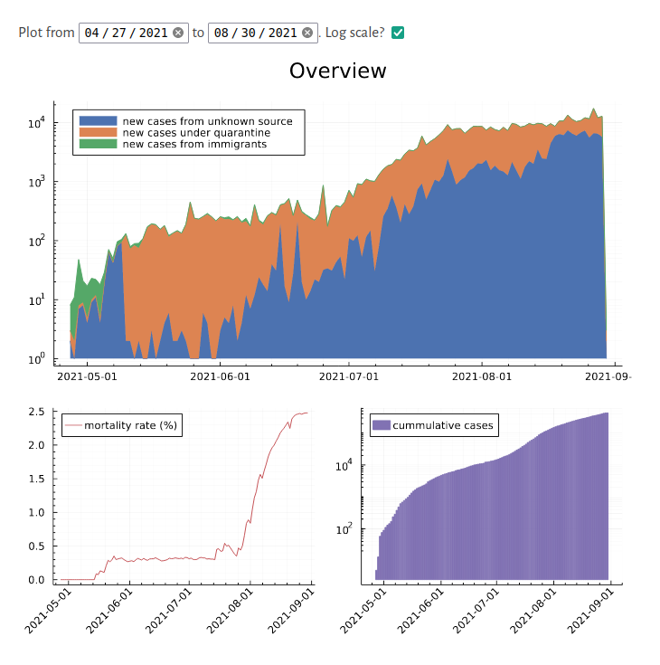

# Vietnam's Covid19 Data Explorations

This repository contains a set of [`Pluto.jl`] notebooks for aggregating and visualizing data for Covid19 cases in Vietnam (since 27th April, 2021).

[Pluto.jl]: https://github.com/fonsp/Pluto.jl

# References

Sources of data and methods used are described and annotated in each of the notebooks.
